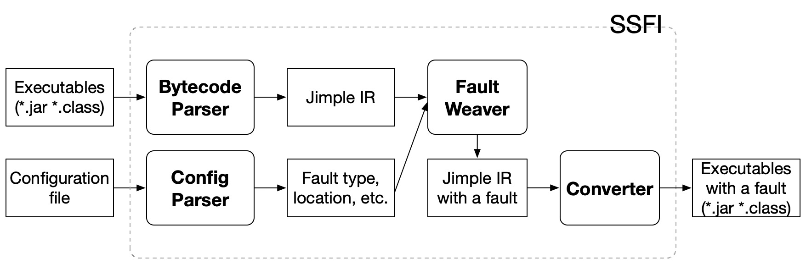
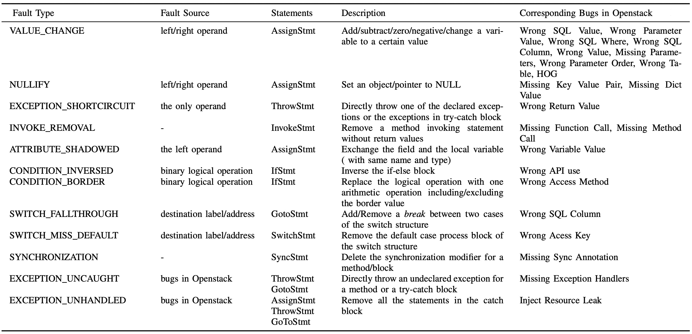

# SSFI Introduction

SSFI is a Statement-level Software Fault Injection tool, which is able to inject 12 different types of software faults into software systems that can be compiled into Java Bytecode. 

The fault types are listed in the following table.

# Guide
## build
mvn clean && mvn compile && mvn package

## run
 java -cp ssfi.jar com.alex.ssfi.Application config.yaml

# Reference
1. Yang, Yong, et al. "How far have we come in detecting anomalies in distributed systems? an empirical study with a statement-level fault injection method." 2020 IEEE 31st International Symposium on Software Reliability Engineering (ISSRE). IEEE, 2020.

